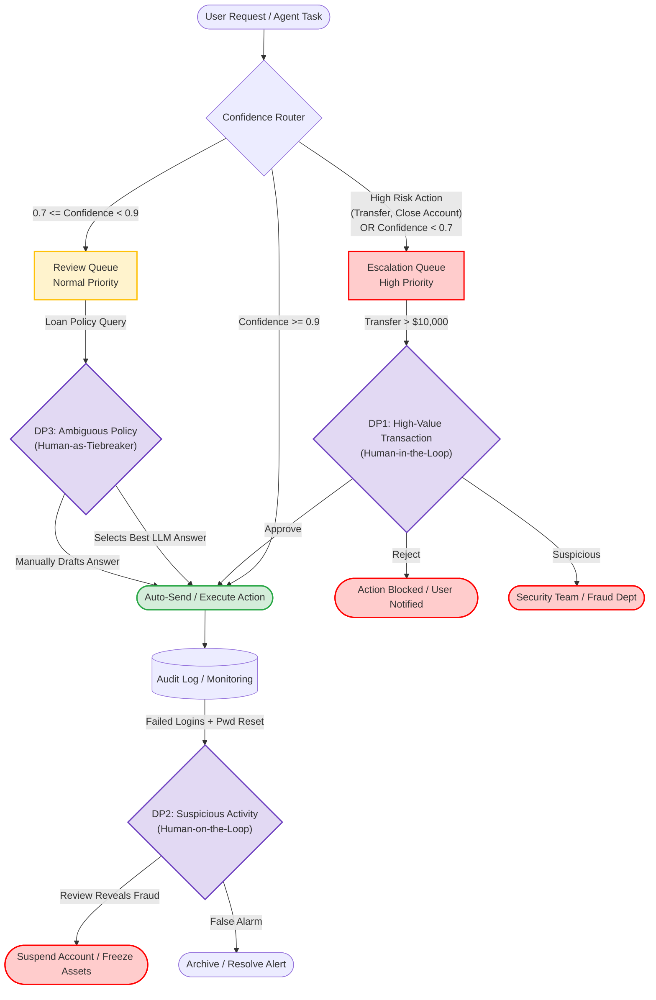

# Sơ đồ luồng HITL (Human-in-the-Loop Flowchart)

Sơ đồ dưới đây minh hoạ bộ định tuyến Confidence Router và 3 điểm quyết định có con người can thiệp (HITL Decision Points) trong hệ thống AI của VinBank, bao gồm các con đường leo thang xử lý (escalation paths).

## Chi tiết 3 điểm quyết định (Decision Points)

1. **DP1: High-Value Transaction Review (Human-in-the-loop)**
   - **Trigger:** Người dùng yêu cầu chuyển khoản trên $10,000. Lệnh này nằm trong danh sách rủi ro cao (High Risk) nên bị đẩy thẳng vào hàng đợi Escalation.
   - **Xử lý:** Giao dịch bị chặn lại cho đến khi nhân viên (Human) vào xem xét bối cảnh (Context: Lịch sử tài khoản, IP,...) rồi quyết định Approve, Reject, hoặc báo cáo Fraud.

2. **DP2: Suspicious Account Activity (Human-on-the-loop)**
   - **Trigger:** Hệ thống giám sát (Audit Log) nhận thấy Agent ghi nhận nhiều lần đăng nhập sai mật khẩu kèm theo một lệnh reset mật khẩu từ một IP lạ.
   - **Xử lý:** Agent vẫn xử lý yêu cầu (Auto-send), nhưng cảnh báo được sinh ra ngầm cho nhân viên bảo mật (Human) theo dõi. Nếu nhân viên phát hiện bất thường, họ sẽ đóng băng tài khoản sau đó.

3. **DP3: Ambiguous Policy Question (Human-as-tiebreaker)**
   - **Trigger:** Người dùng hỏi một câu phức tạp về chính sách vay vốn mà AI chỉ đạt điểm tự tin (Confidence) ở mức trung bình (ví dụ 0.8).
   - **Xử lý:** Câu trả lời không gửi đi ngay mà đưa vào Review Queue. Một nhân viên (Human) sẽ vào đọc câu hỏi, xem 2 phương án trả lời do AI gợi ý, và chọn phương án đúng nhất (Tiebreaker) hoặc tự soạn lại câu trả lời.
